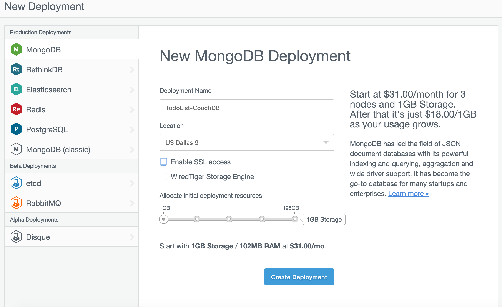
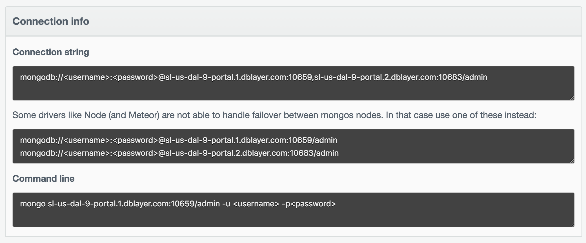
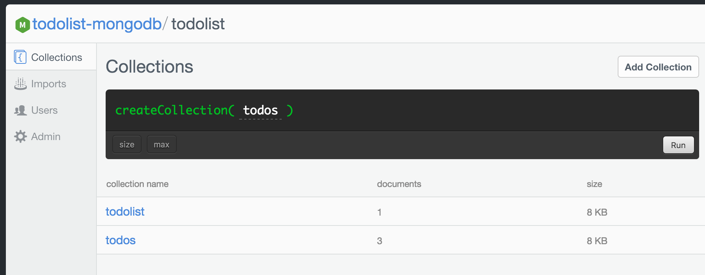
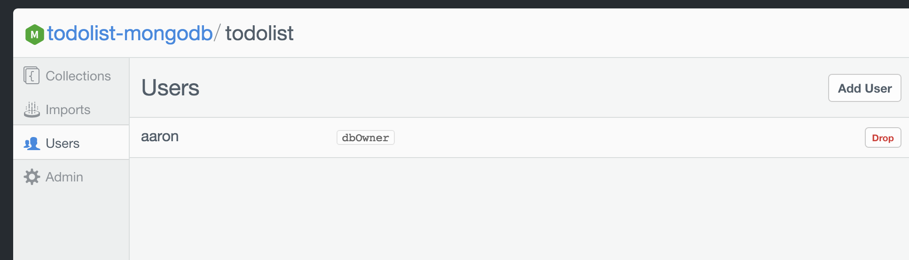
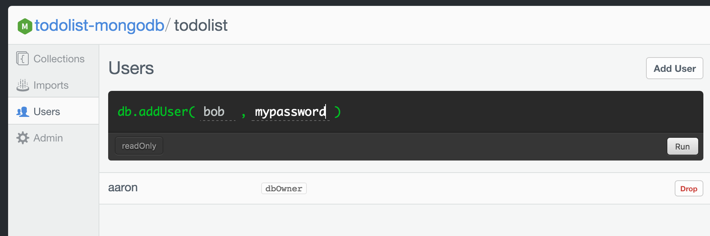
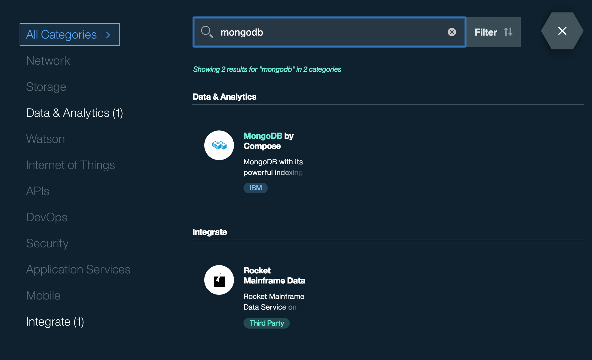
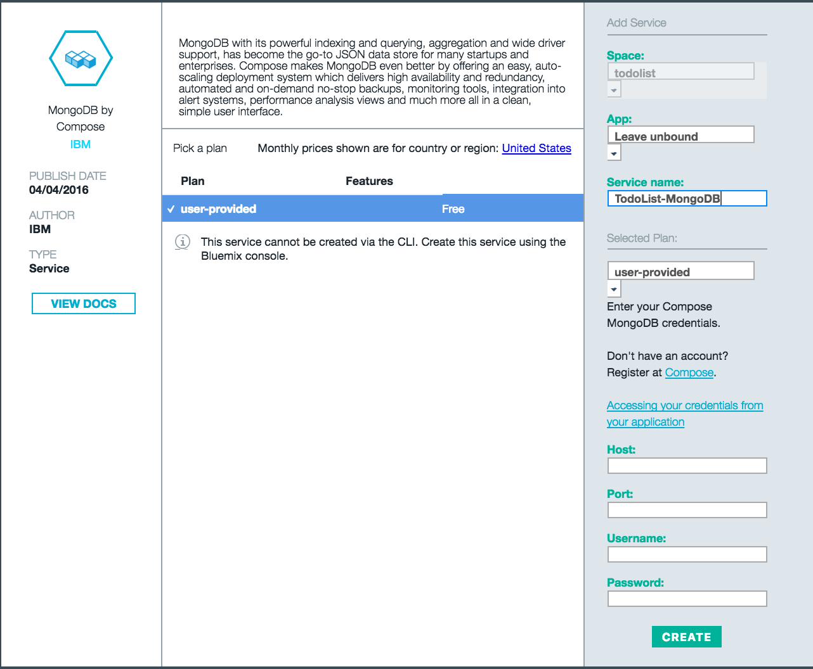
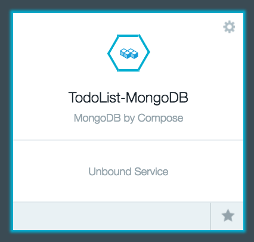

# Todolist MongoDB

Todolist implemented for Cloudant (MongoDB) backend


### Initial Setup:

- Download the [Swift DEVELOPMENT 06-06 snapshot](https://swift.org/download/#snapshots)

- Download MongoDB

  You can use `brew install mongodb` If you are using mongodb for the first time create the directory to which the mongod process will write data
  `mkdir -p /data/db`

  More information can be found [here](https://docs.mongodb.com/manual/tutorial/install-mongodb-on-os-x/)

  Additionally, you can view the database' shell with `mongo`

- Clone the TodoList-mongodb repository


### Running Locally:

1. You can start your database by running `mongod`

2. Build the project and run it
    ```
    swift build
    ./build/debug/todolist-mongodb
    ```
3. Open the [TodoList Client](http://www.todobackend.com/client/index.html?http://localhost:8090) and enjoy!

### Setting up MongoDB by Compose ###

1. Get an account for [Compose](https://www.compose.com/mongodb/)

2. Navigate to deployment section on the side bar. Select MongoDB and set your deployment name, location, and disable SSL access

    

3. Create Deployment and you should see a field for your connection info.

    

4. Setup a new database called `todolist`

5. Setup a collection with `todolist` called `todos`

    

5. Add a new user to the `todolist` database

    

    

Now, you can access your Mongo Database with the given host and port or connect it to bluemix

### Deploying To Bluemix:

1. Get an account for [Bluemix](https://new-console.ng.bluemix.net/?direct=classic)

    #### Setup the MongoDB Service

2. If you haven't already, setup MongoDB by Compose described in the section above

3. Select the MongoDB by Compose Service

    

4. Set the Service name as `TodoList-MongoDB` then initialize the Host, Port, Username, and Password to the values instantiated in the above section

    

5. Upon creation, you should see your unbound service on the dashboard page

    <center></center>

    #### Next Steps: Push to Bluemix

6. Download and install the [Cloud Foundry tools](https://new-console.ng.bluemix.net/docs/starters/install_cli.html):
```
cf login
bluemix api https://api.ng.bluemix.net
bluemix login -u username -o org_name -s space_name
```

    Be sure to change the directory to the todolist-mongodb directory where the manifest.yml file is located.

7. Run `cf push`

    #### Note: The uploading droplet stage should take a long time, roughly 4-6 minutes. If it worked correctly, it should say:
```
2 of 2 instances running
App started
```


### Testing:

- Run the test cases locally with
```
git submodule init
git submodule update
swift test
```

- Alternatively, checkout the specs on [TodoList-Backend](http://www.todobackend.com/specs/index.html?http://localhost:8090) and set the appropriate url to test

## License

This library is licensed under Apache 2.0. Full license text is available in [LICENSE](LICENSE).
